# Soft Landing

### Passenger Disruption Management — Software Architecture

 

Dual-view system: **passenger app** (KMP) + **gate agent dashboard** (React) + **backend agent** (Python)

 

Disruption Engine · Option Generator · State Manager

<!--
Cover slide. Introduce the project and the three main backend components.
-->

---
layout: section
---

# High-Level System Overview

---

# System Architecture

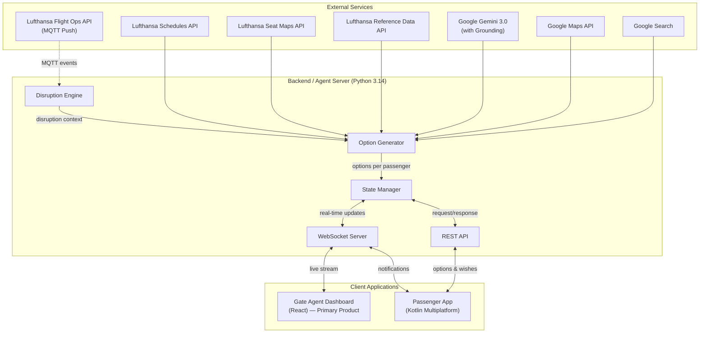

<!--
Three layers: external services, backend agent server, client applications.
The backend orchestrates everything through Disruption Engine → Option Generator → State Manager.
-->

---
layout: section
---

# Component Decomposition

---

# Backend Components

```mermaid {scale: 0.65}
graph LR
    subgraph DE["1. Disruption Engine"]
        DE_MQTT["MQTT Listener"]
        DE_PARSE["Event Parser"]
        DE_SCOPE["Impact Scope<br/>Calculator"]
        DE_NOTIFY["Notification<br/>Dispatcher"]
    end

    DE_MQTT --> DE_PARSE --> DE_SCOPE --> DE_NOTIFY

    subgraph OG["2. Option Generator"]
        OG_FLIGHT["Flight Rebooking<br/>Module"]
        OG_HOTEL["Hotel + Next-Day<br/>Module"]
        OG_GROUND["Ground Transport<br/>Module"]
        OG_ALT["Alt. Airport<br/>Module"]
        OG_EXPLAIN["Explanation<br/>Generator (Gemini)"]
    end

    subgraph SM["3. State Manager"]
        SM_PAX["Passenger Registry"]
        SM_WISH["Wish Tracker"]
        SM_PRIO["Priority Queue"]
        SM_CONFLICT["Conflict Notifier"]
    end

    DE_NOTIFY --> OG
    OG --> SM
```

<!--
Three core backend modules connected in a pipeline.
Disruption Engine detects and parses events, Option Generator creates resolution options, State Manager tracks passenger choices and agent approvals.
-->

---

# Disruption Engine

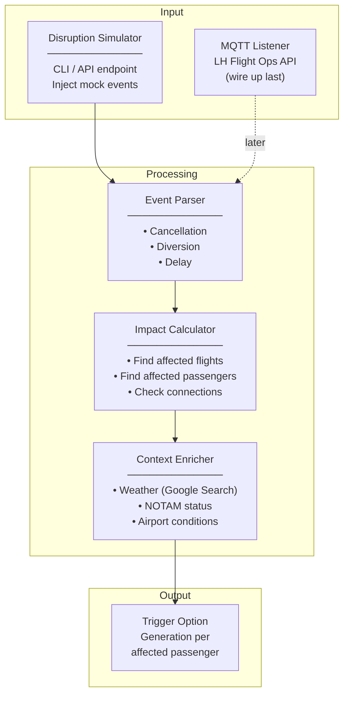

### Deliverables

<v-clicks>

- **Disruption simulator** — day one, mock trigger via CLI/REST
- Event parser for cancellation, diversion, delay
- Affected passenger lookup (connections, destinations)
- Context enrichment via Gemini + Google Search
- MQTT client for LH Flight Ops (Phase 4, if time)

</v-clicks>

<!--
The simulator is the key enabler — lets us develop the full pipeline without waiting for real MQTT events.
-->

---

# Option Generator

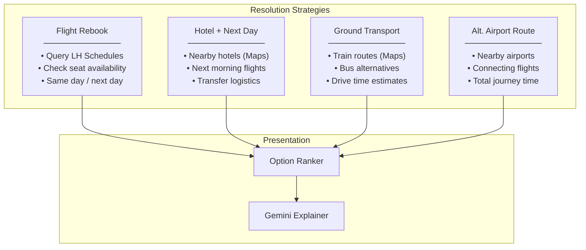

### Deliverables

<v-clicks>

- **4 strategy modules** — flight, hotel, ground, alt-airport
- Each module callable independently
- Option ranking by arrival time & disruption level
- **Gemini-powered explanations** with Google Search/Maps grounding
- Returns 3-4 concrete options per passenger

</v-clicks>

<!--
Each strategy module can be developed and tested independently. Gemini generates plain-language explanations grounded in real search results.
-->

---

# State Manager

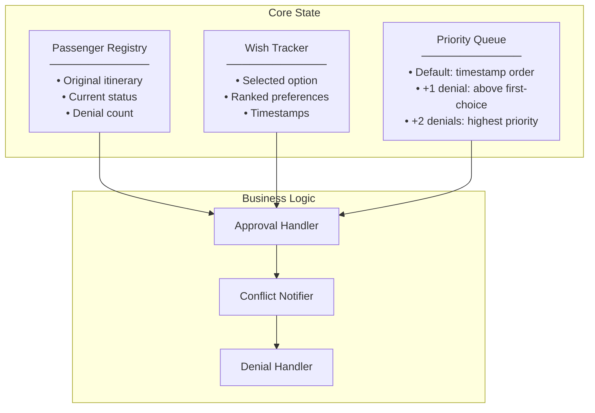

### Deliverables

<v-clicks>

- In-memory passenger state store (clear interfaces)
- Wish tracking with ranked preference support
- **Priority queue** — denial-based escalation
- Post-approval conflict notification (simplified)
- Approval/denial handlers with real-time dispatch

</v-clicks>

<!--
Priority escalation ensures denied passengers don't get stuck at the back of the queue.
Post-approval conflict handling is simplified: just mark conflicting options unavailable and notify.
-->

---
layout: section
---

# Data Flow

End-to-end workflow

---

# End-to-End Sequence

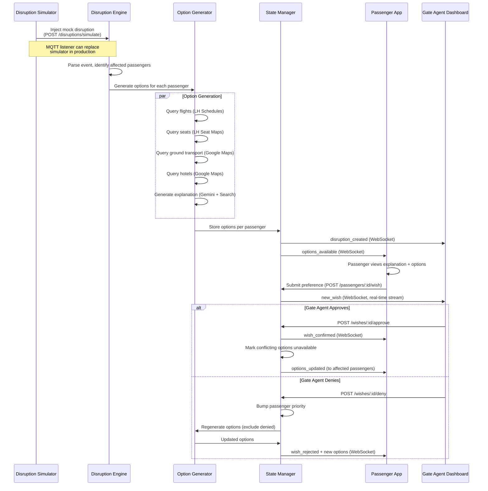

<!--
The full happy path: disruption → options → passenger chooses → gate agent approves/denies → conflict resolution.
Denial triggers priority escalation and option regeneration.
-->

---
layout: section
---

# Client Applications

---

# Gate Agent Dashboard (React) — Primary Product

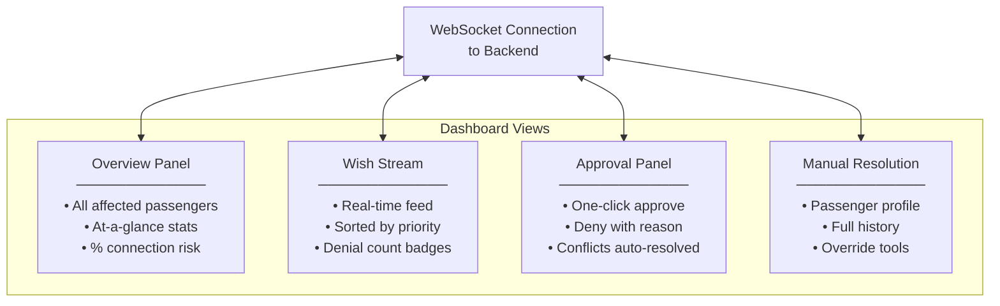

<v-click>

**Key:** React SPA · WebSocket real-time · Priority-sorted wish stream · One-click approval workflow

</v-click>

<!--
This is the primary demo product. The dashboard gives gate agents a real-time view of passenger wishes and lets them approve or deny with one click.
-->

---

# Passenger App (Kotlin Multiplatform)

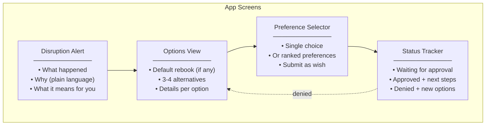

### Targets

- Android (native)
- iOS (native)
- Web (Compose for Web)

### Deliverables

<v-clicks>

- Compose Multiplatform UI
- WebSocket push notifications
- API client for backend
- 4 screens: alert → options → preference → status

</v-clicks>

<!--
The passenger app uses Kotlin Multiplatform to target all three platforms from a single codebase.
Denied passengers loop back to the options view with regenerated alternatives.
-->

---
layout: section
---

# API Contract

---
layout: two-cols-header
---

# Core Data Types

::left::

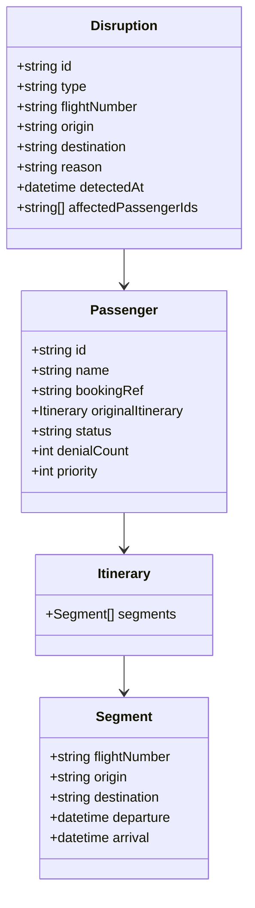

::right::

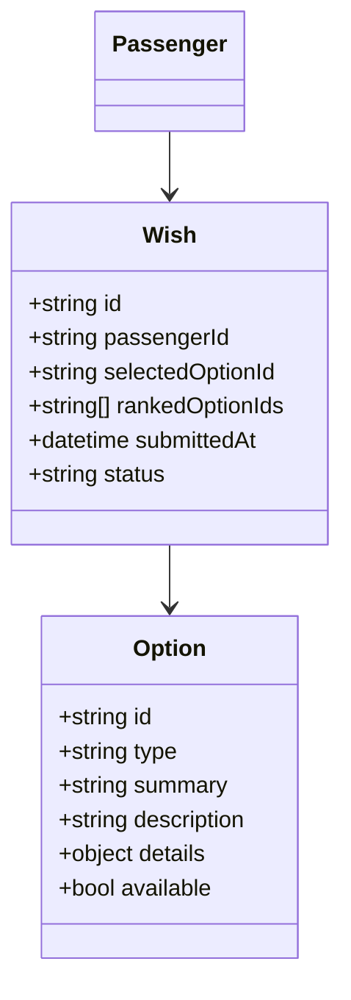

<v-click>

**Option types:** `rebook` · `hotel` · `ground` · `alt_airport`

**Wish status:** `pending` → `approved` | `denied`

**Passenger status:** `unaffected` → `notified` → `chose` → `approved` | `denied`

</v-click>

<!--
These types are the shared contract between backend and both frontends. Defined upfront so teams can work in parallel.
-->

---

# WebSocket Events & REST Endpoints

### WebSocket Events

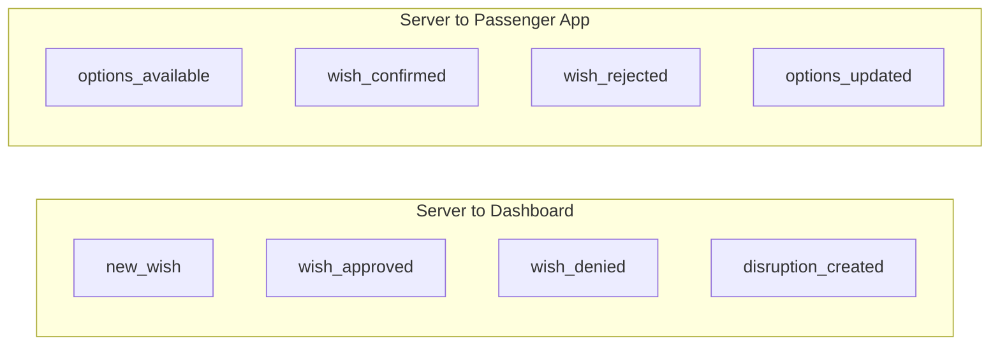

### REST Endpoints

| Method | Path | Used by |
|--------|------|---------|
| POST | `/disruptions/simulate` | Simulator |
| GET | `/disruptions/:id` | Dashboard |
| GET | `/disruptions/:id/passengers` | Dashboard |
| GET | `/passengers/:id/options` | Pax App |
| POST | `/passengers/:id/wish` | Pax App |
| POST | `/wishes/:id/approve` | Dashboard |
| POST | `/wishes/:id/deny` | Dashboard |

<!--
WebSocket for real-time push, REST for request/response. Dashboard is WebSocket-primary, passenger app uses both.
-->

---
layout: section
---

# Implementation Roadmap

---

# Parallel Implementation Strategy

All three components built **in parallel from day one**. Backend starts with hardcoded mock responses.

```mermaid {scale: 0.65}
gantt
    title Implementation Roadmap (Parallel)
    dateFormat X
    axisFormat %s

    section Phase 1 — Foundation
    API contract + shared types        :p1, 0, 1
    Disruption simulator (mock trigger):p2, 0, 1
    Backend scaffolding + mock API     :p3, 0, 2
    State Manager (in-memory)          :p4, 0, 2
    Passenger App scaffold + screens   :p5, 0, 2
    Gate Agent Dashboard scaffold      :p6, 0, 2

    section Phase 2 — Core Features
    Flight rebook module               :p7, 2, 4
    Hotel + next-day module            :p8, 2, 4
    Ground transport module            :p9, 2, 4
    Gemini explanation generator       :p10, 2, 4
    Dashboard wish stream + approve    :p11, 2, 4
    Passenger App options + wish flow  :p12, 2, 4
    WebSocket real-time layer          :p13, 2, 4

    section Phase 3 — Logic + Polish
    Priority queue + escalation        :p14, 4, 6
    Post-approval conflict notify      :p15, 4, 6
    Approval/denial flow end-to-end    :p16, 4, 6

    section Phase 4 — Integration + Demo
    Swap mocks for real LH/Gemini APIs :p17, 6, 8
    MQTT listener (if time allows)     :p18, 7, 8
    End-to-end demo scenarios          :p19, 8, 10
```

<!--
Mock-first approach lets all teams move in parallel. Real API integrations are swapped in Phase 4.
-->

---

# Technology Map

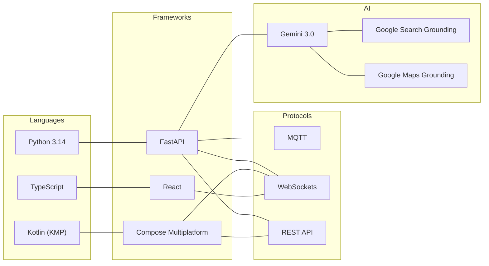

<!--
Three languages, three frameworks, three protocols. Gemini with grounding is the AI backbone.
-->

---
layout: end
---

# Soft Landing

Let's build it.
