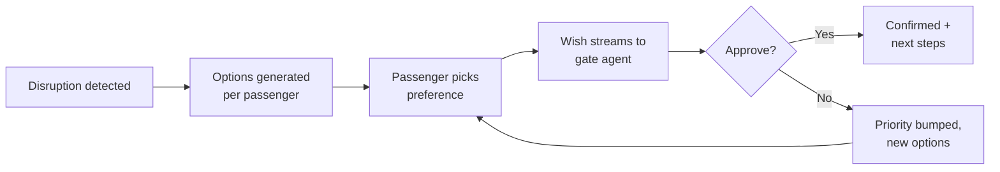
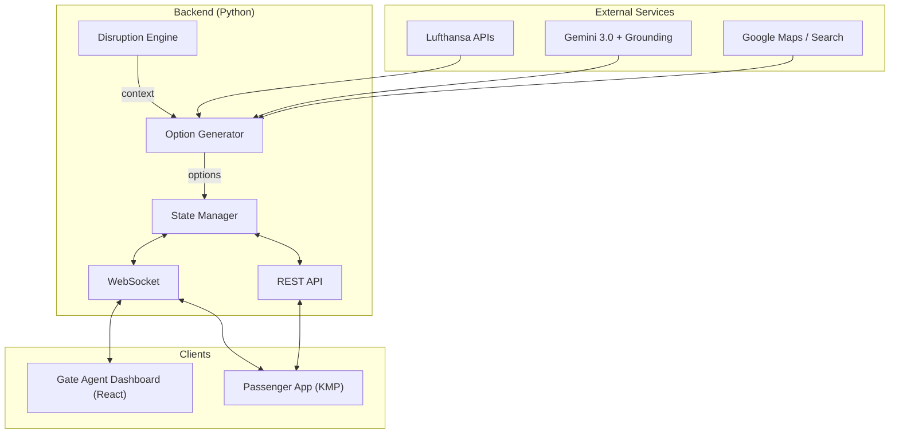
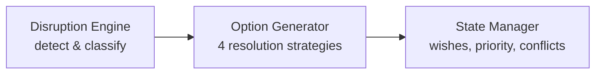
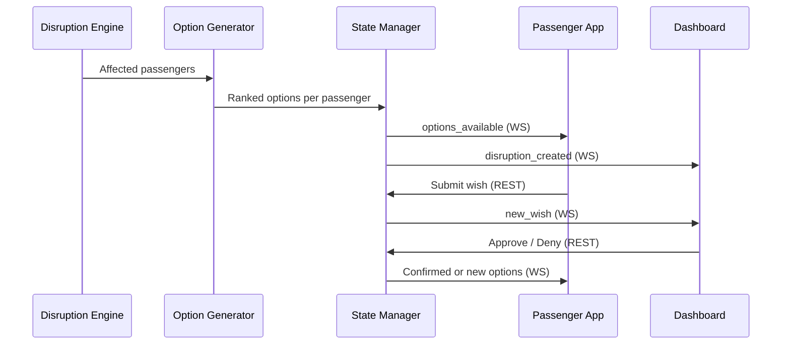
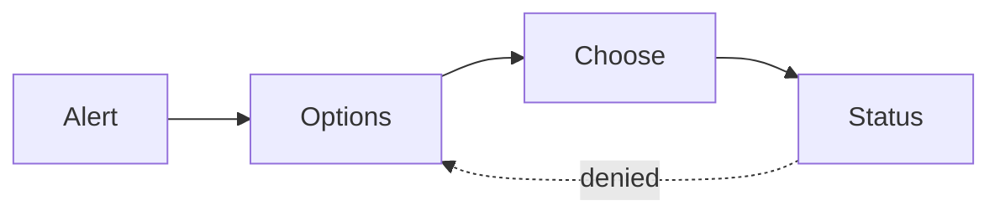
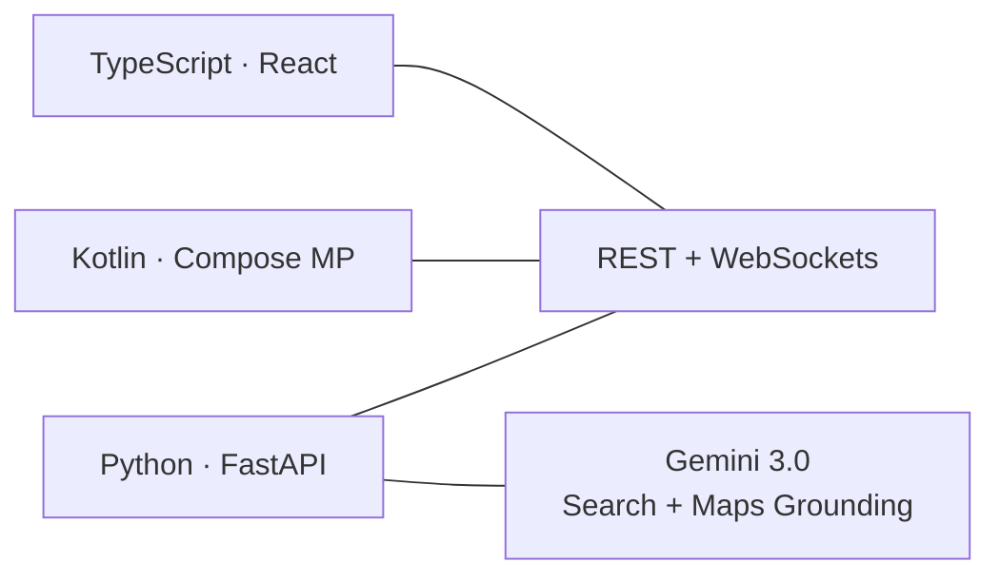

# Soft Landing

### Passenger Disruption Management

 

**Passenger app** (KMP) · **Gate agent dashboard** (React) · **Backend** (Python)

---

# The Problem

When flights break, passengers crowd the gate desk and agents drown in manual rebooking — one passenger at a time, while 200 others wait.

 

### No visibility into cascading impact

- Agent approves a seat — but that seat was the last option for three other passengers
- Denied passengers go to the back of the line and start over
- No way to see the big picture or prioritize

---

# Soft Landing

An **operational command center** for gate agents backed by a passenger self-service app.

 

- **Passengers** get a disruption explanation and choose from AI-generated options (rebook, hotel, ground transport, alt airport)
- **Preferences stream** into the gate agent's dashboard in real time
- **Gate agent stays in control** — human-in-the-loop approval for every decision
- **AI does the heavy lifting** — Gemini generates options and plain-language explanations grounded in live data (flights, maps, search)

---

# How It Works

 

Passenger choice = **wish**, not booking. Gate agent has final say. Denied passengers get escalated priority — they don't go to the back of the line.

---

# System Architecture

<!--
Three layers: external APIs, backend pipeline, two client apps.
-->

---

# Backend Pipeline

 

| Component | Role |
|-----------|------|
| **Disruption Engine** | Receives events (simulator / MQTT), identifies affected passengers |
| **Option Generator** | Queries LH + Maps + Gemini, produces ranked options with explanations |
| **State Manager** | Tracks wishes, handles approvals/denials, escalates priority on denial |

---

# Data Flow

---

# Gate Agent Dashboard

React SPA with WebSocket real-time updates

| View | Purpose |
|------|---------|
| **Overview** | All affected passengers, connection risk stats |
| **Wish Stream** | Live feed of passenger preferences, sorted by priority |
| **Approval Panel** | One-click approve, deny with reason |
| **Manual Resolution** | Full passenger profile and override tools |

---

# Passenger App

Kotlin Multiplatform → Android, iOS, Web

 

- **Alert** — plain-language explanation of disruption (Gemini-generated)
- **Options** — 3-4 alternatives: rebook, hotel, ground transport, alt airport
- **Choose** — single pick or ranked preferences, submitted as wish
- **Status** — tracks approval; denial loops back with new options

---

# API Contract

### Core Types

- **Disruption** — type, flight, affected passengers
- **Passenger** — itinerary, status, denial count, priority
- **Option** — type (`rebook` | `hotel` | `ground` | `alt_airport`), availability
- **Wish** — selected option, status (`pending` → `approved` | `denied`)

### Endpoints

| Method | Path |
|--------|------|
| POST | `/disruptions/simulate` |
| GET | `/passengers/:id/options` |
| POST | `/passengers/:id/wish` |
| POST | `/wishes/:id/approve` |
| POST | `/wishes/:id/deny` |

WebSocket events: `disruption_created`, `new_wish`, `options_available`, `wish_confirmed`, `wish_rejected`, `options_updated`

---

# Technology Stack

 

| Layer | Choice |
|-------|--------|
| Backend | Python 3.14, FastAPI |
| Passenger App | Kotlin Multiplatform (Compose) |
| Dashboard | React, TypeScript |
| AI | Gemini 3.0 with Google Search & Maps grounding |
| Protocols | REST, WebSockets, MQTT (later) |

---
layout: end
---

# Soft Landing

Let's build it.
