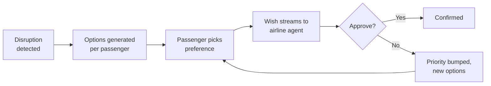
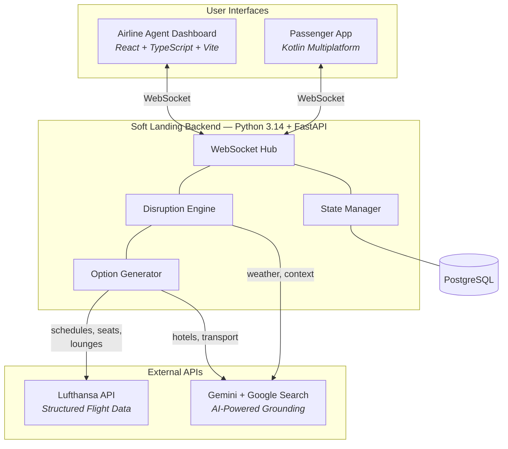

# Soft Landing

### Airline Disruption Management

 

Snowstorm hits Munich. 8 flights cancelled. 200+ passengers stranded.

Today: one airline agent, one passenger at a time, hours of chaos.

**Soft Landing: all 200 passengers handled in minutes.**

 

Jörg · David · Malte · Claude & Gemini

---

# The Problem

### For passengers

- Stuck in a queue with no information
- No visibility into alternatives
- Denied? Back of the line

### For airline agents

- Manual rebooking, one at a time
- No view of cascading impact
- Approve a seat — but it was the last option for 3 other passengers

 

> A cancelled flight with 200 passengers takes **3-4 hours** to resolve manually.

---

# The Solution

Two apps, one real-time backend.

 

### 📱 Passenger App
- See what happened (plain-language explanation)
- Browse personalized options
- Submit a **wish** (preferred resolution)
- Get real-time confirmation

### 🖥️ Airline Agent Dashboard
- See all 200 passengers at once
- Options pre-generated by AI
- Wishes stream in real-time
- One-click approve/deny
- Impact preview before approval

---

# How It Works

 

A passenger's choice is a **wish**, not a booking. The airline agent has final say.

Denied passengers get **escalated priority** — they don't go to the back of the line.

---

# Architecture

---

# Lufthansa API

**Structured flight data** — the backbone of rebooking.

 

| Endpoint | What we use it for |
|----------|--------------------|
| **Flight Status** | Detect cancellations, delays, diversions in real time |
| **Schedules** | Find alternative flights for rebooking options |
| **Seat Maps** | Check actual seat availability before offering a rebook |
| **Lounges** | Offer lounge access to eligible passengers (HON, Senator, Business) |

 

Options are **tailored per passenger** — a HON Circle member gets different alternatives than an economy traveller.

---

# Gemini + Google Search Grounding

**AI-powered real-world context** — the intelligence layer.

 

| Capability | Example |
|------------|---------|
| **Hotel search** | "Find 4-star hotels within 5km of MUC with availability tonight" |
| **Ground transport** | Train/bus/taxi options with schedules and providers |
| **Weather context** | Current conditions affecting operations |
| **Disruption explanations** | Plain-language summaries for passengers |
| **Ahead-of-flight** | Proactive risk briefings before departure |

 

All grounded in **live Google Search + Maps data** — not hallucinated.

---

# Service Level Matrix

Options are automatically personalized based on loyalty tier and booking class.

 

| | HON Circle | Senator | Frequent Traveller | Economy |
|---|---|---|---|---|
| **Hotel** | 5-star, €200/night | 4-star, €150/night | 4-star, €100/night | 3-star, €80/night |
| **Transport** | Limousine | Taxi | Shuttle | Shuttle |
| **Lounge** | First Class | Senator | Business | — |
| **Rebooking** | Any airline | Star Alliance | LH Group | LH Group |
| **Meal** | Lounge | Lounge | Lounge | €12 voucher |

---

# Demo

 

**Live walkthrough**

 

Snowstorm scenario → passenger options → wish submission → agent approval

 

Dashboard + Mobile App side by side

---
layout: end
---

# Soft Landing

200 passengers. Minutes, not hours.

Real flight data · AI-powered options · Real-time sync

 

Jörg · David · Malte · Claude & Gemini
