# Soft Landing — Software Architecture

> Decomposition of the system into implementable components

---

## High-Level System Overview

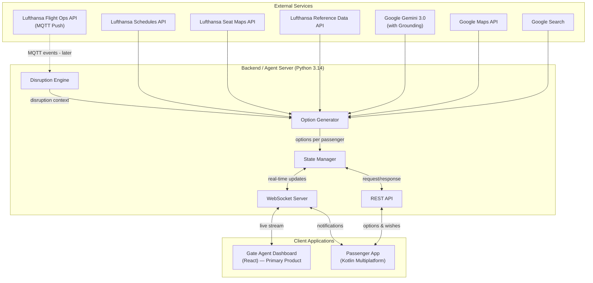

---

## Component Decomposition

```mermaid
graph LR
    subgraph DE["1. Disruption Engine"]
        DE_MQTT["MQTT Listener"]
        DE_PARSE["Event Parser"]
        DE_SCOPE["Impact Scope<br/>Calculator"]
        DE_NOTIFY["Notification<br/>Dispatcher"]
    end

    DE_MQTT --> DE_PARSE --> DE_SCOPE --> DE_NOTIFY

    subgraph OG["2. Option Generator"]
        OG_FLIGHT["Flight Rebooking<br/>Module"]
        OG_HOTEL["Hotel + Next-Day<br/>Module"]
        OG_GROUND["Ground Transport<br/>Module"]
        OG_ALT["Alt. Airport<br/>Module"]
        OG_EXPLAIN["Explanation<br/>Generator (Gemini)"]
    end

    subgraph SM["3. State Manager"]
        SM_PAX["Passenger Registry"]
        SM_WISH["Wish Tracker"]
        SM_PRIO["Priority Queue"]
        SM_CONFLICT["Conflict Notifier"]
    end

    DE_NOTIFY --> OG
    OG --> SM
```

---

## Data Flow — End-to-End Workflow

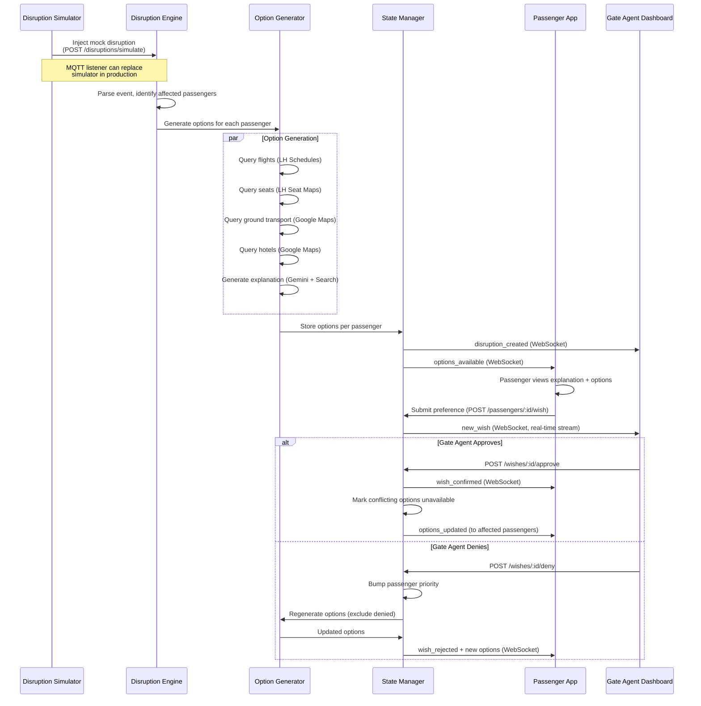

---

## Component Details & Implementable Modules

### Module 1: Disruption Engine

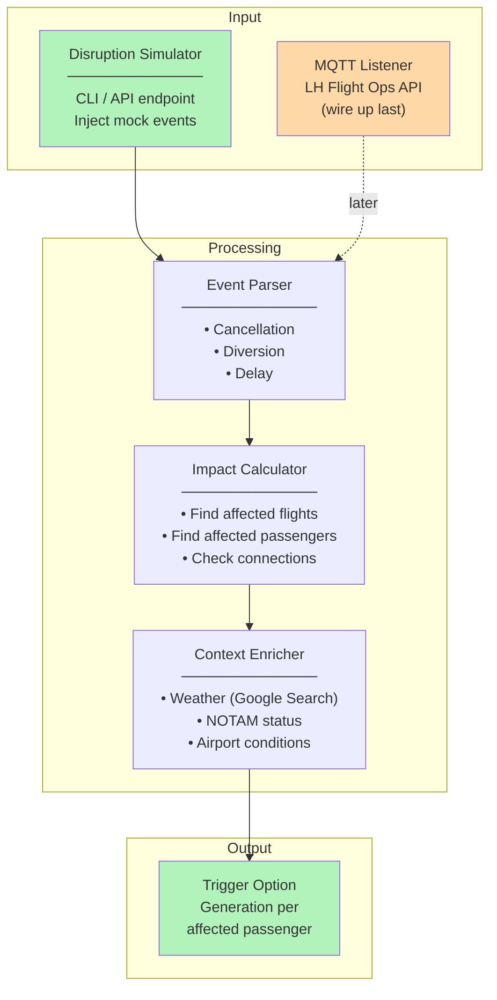

**Deliverables:**
- **Disruption simulator** (Phase 1, day one): CLI command or REST endpoint that injects mock disruption events directly into the engine — enables full-pipeline testing without MQTT
- Event parser supporting cancellation, diversion, delay types
- Affected passenger lookup (connecting passengers, destination passengers)
- Context enrichment via Gemini + Google Search grounding
- MQTT client subscribing to LH Flight Ops events (Phase 4, if time allows)

---

### Module 2: Option Generator

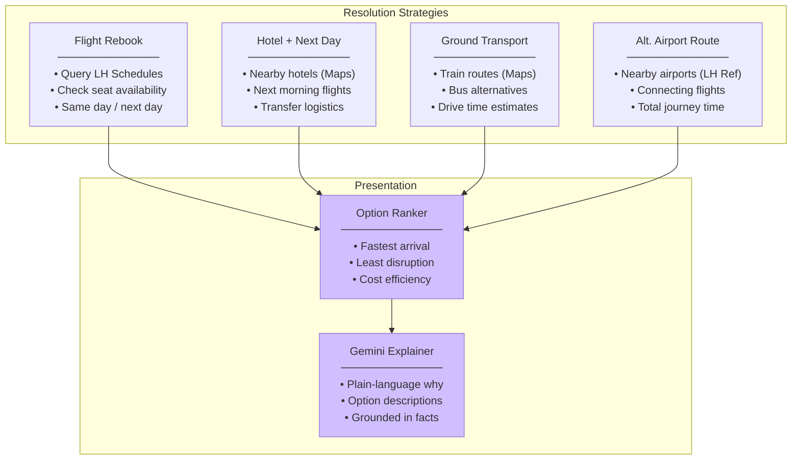

**Deliverables:**
- 4 strategy modules (flight, hotel, ground, alt-airport), each callable independently
- Option ranking by arrival time and disruption level
- Gemini-powered plain-language explanations with Google Search/Maps grounding
- Returns 3-4 concrete options per passenger

---

### Module 3: State Manager

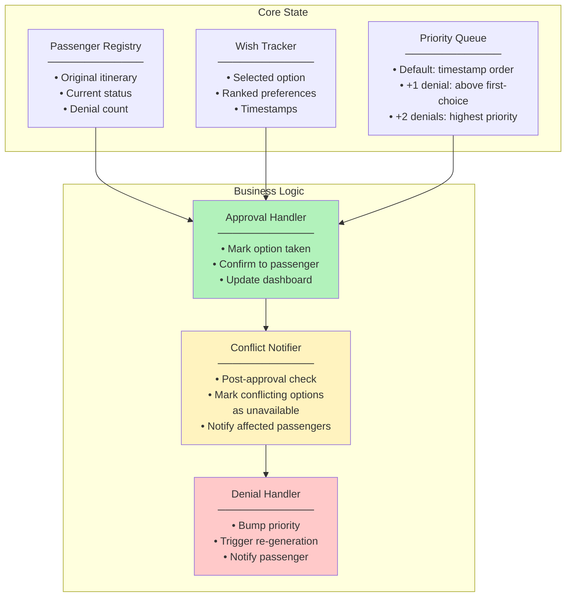

**Deliverables:**
- Passenger state store (in-memory for hackathon, with clear interfaces)
- Wish tracking with ranked preference support
- Priority queue with denial-based escalation
- **Simplified conflict handling:** when a wish is approved, mark conflicting options as unavailable and notify affected passengers (no pre-approval impact preview — keep it simple)
- Approval/denial handlers with real-time notification dispatch

---

### Module 4: Gate Agent Dashboard (React) — Primary Product

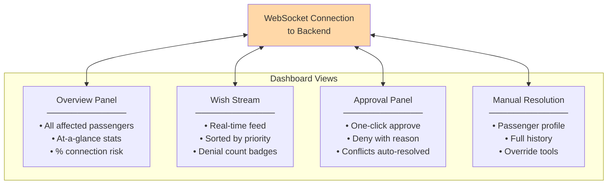

**Deliverables:**
- React SPA with WebSocket connection for real-time updates
- Overview panel with disruption stats
- Live wish stream sorted by priority (denied passengers first)
- Approval workflow with post-approval conflict notification
- Manual resolution view for edge cases

---

### Module 5: Passenger App (Kotlin Multiplatform)

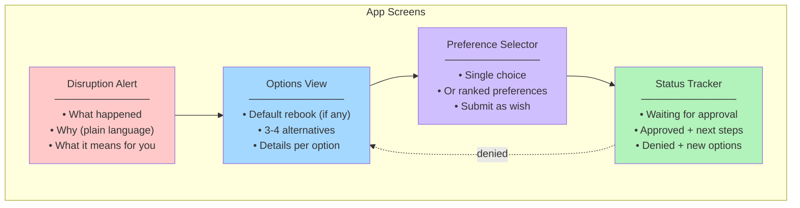

**Deliverables:**
- Compose Multiplatform UI (Android, iOS, Web targets)
- Push notification receiver (WebSocket-based)
- API client for backend communication
- 4 main screens: alert, options, preference selector, status tracker

---

## Implementation Priority

All three components (backend, passenger app, dashboard) are built **in parallel from day one**. The backend starts with hardcoded mock responses so frontends can develop against real API shapes immediately. Real API integrations are swapped in later.

```mermaid
gantt
    title Implementation Roadmap (Parallel)
    dateFormat X
    axisFormat %s

    section Phase 1 — Foundation (all teams)
    API contract + shared types        :p1, 0, 1
    Disruption simulator (mock trigger):p2, 0, 1
    Backend scaffolding + mock API     :p3, 0, 2
    State Manager (in-memory)          :p4, 0, 2
    Passenger App scaffold + screens   :p5, 0, 2
    Gate Agent Dashboard scaffold      :p6, 0, 2

    section Phase 2 — Core Features (parallel)
    Flight rebook module               :p7, 2, 4
    Hotel + next-day module            :p8, 2, 4
    Ground transport module            :p9, 2, 4
    Gemini explanation generator       :p10, 2, 4
    Dashboard wish stream + approve    :p11, 2, 4
    Passenger App options + wish flow  :p12, 2, 4
    WebSocket real-time layer          :p13, 2, 4

    section Phase 3 — Logic + Polish
    Priority queue + escalation        :p14, 4, 6
    Post-approval conflict notify      :p15, 4, 6
    Approval/denial flow end-to-end    :p16, 4, 6

    section Phase 4 — Integration + Demo
    Swap mocks for real LH/Gemini APIs :p17, 6, 8
    MQTT listener (if time allows)     :p18, 7, 8
    End-to-end demo scenarios          :p19, 8, 10
```

---

## API Contract (Phase 1 — define before building)

The shared data model that all three components agree on. Defined upfront so backend and frontends can be built in parallel against the same shapes.

### Core Types

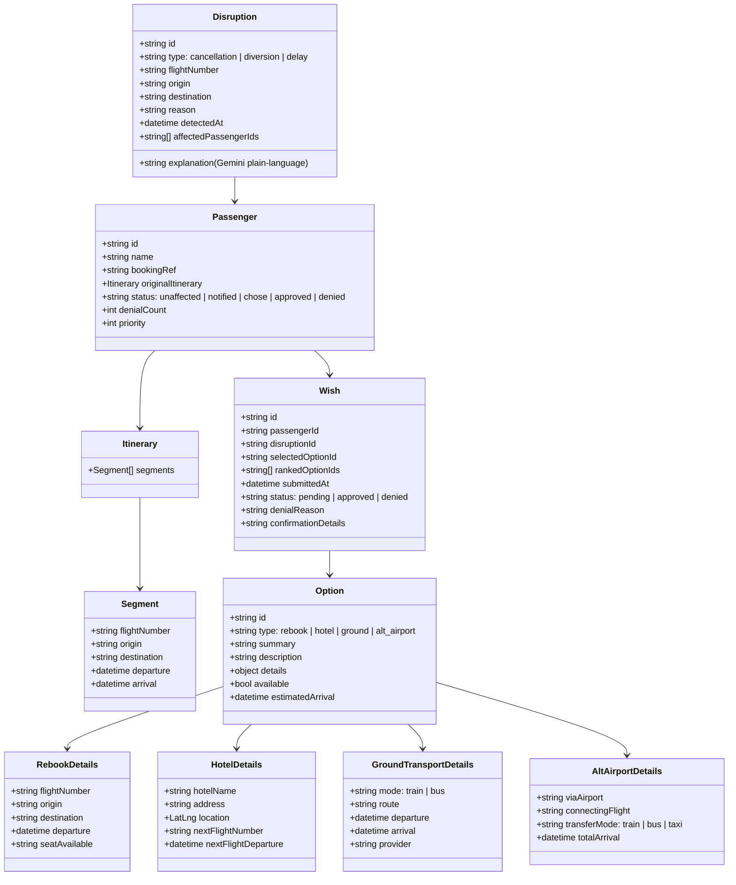

### WebSocket Event Types

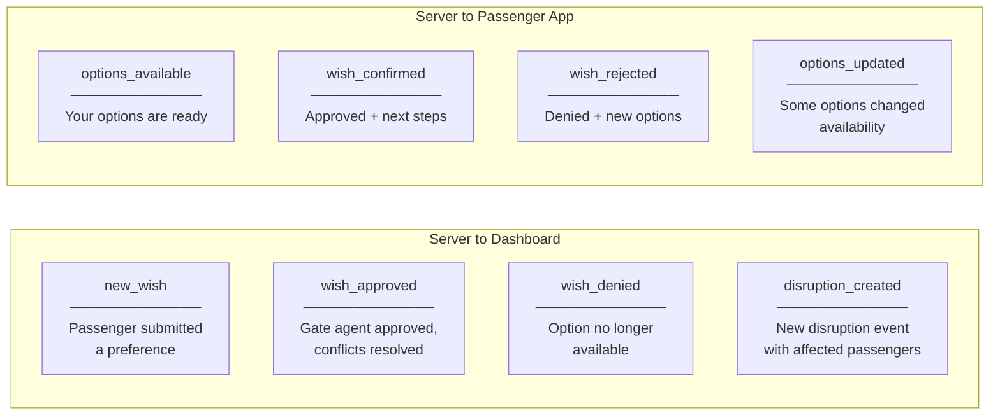

### WebSocket Connections

```
WS /ws/passenger/{passenger_id}     ← Passenger App connects here
WS /ws/dashboard/{disruption_id}    ← Gate Agent Dashboard connects here
```

**Message envelope** (all WS messages use this shape):

```json
{
  "type": "wish_confirmed | options_available | ...",
  "timestamp": "2026-03-01T14:30:00Z",
  "data": { ... }
}
```

### REST Endpoints

| Method | Path | Used by | Purpose |
|--------|------|---------|---------|
| POST | `/disruptions/simulate` | Simulator | Inject mock disruption |
| GET | `/disruptions/:id` | Dashboard | Get disruption details + explanation |
| GET | `/disruptions/:id/passengers` | Dashboard | List affected passengers (sorted by priority → timestamp) |
| GET | `/passengers/:id/disruptions` | Passenger App | List active disruptions affecting this passenger |
| GET | `/passengers/:id/options` | Passenger App | Get available options with details |
| GET | `/passengers/:id/status` | Passenger App | Current state: waiting / approved / denied |
| POST | `/passengers/:id/wish` | Passenger App | Submit ranked preference(s) |
| GET | `/passengers/:id/profile` | Dashboard | Full profile for manual resolution (itinerary, wishes, denial history) |
| POST | `/wishes/:id/approve` | Dashboard | Approve a wish |
| POST | `/wishes/:id/deny` | Dashboard | Deny a wish with reason |
| GET | `/wishes?disruption_id=X` | Dashboard | All wishes for a disruption |

**Authentication (hackathon scope):**
- Passenger App: booking reference + last name as token
- Gate Agent Dashboard: static API key or unauth'd for demo

---

## Technology Map

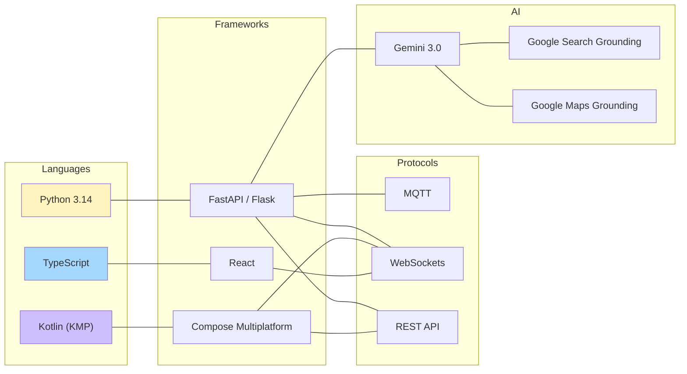
