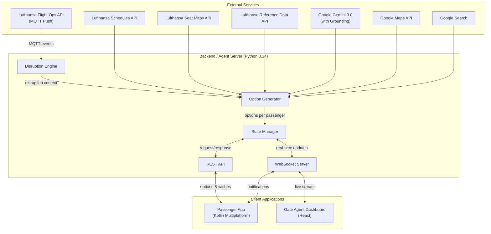
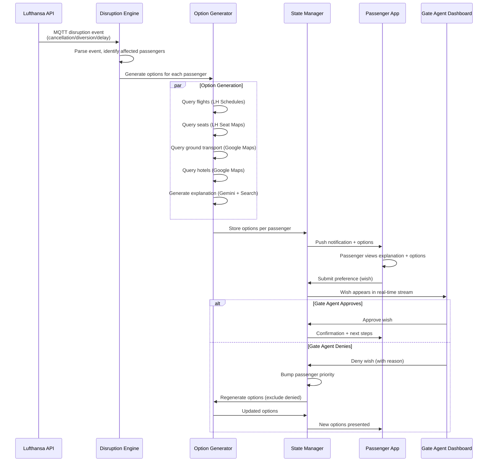
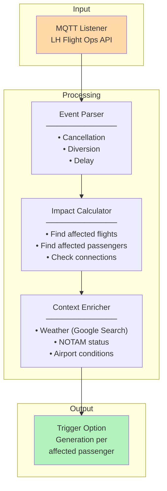
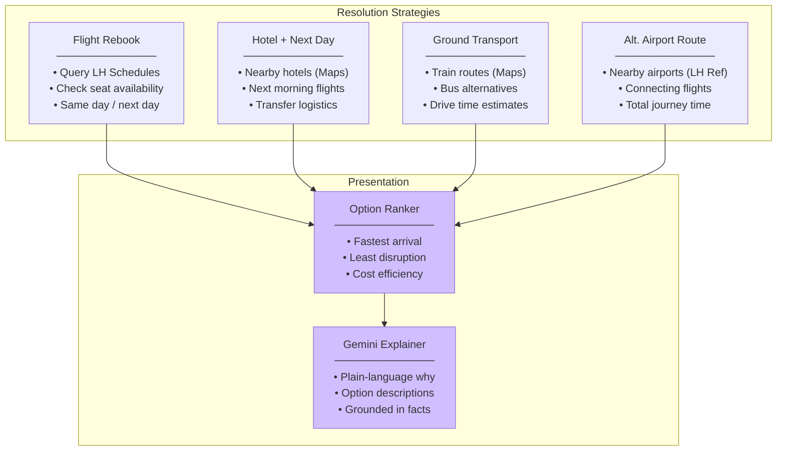
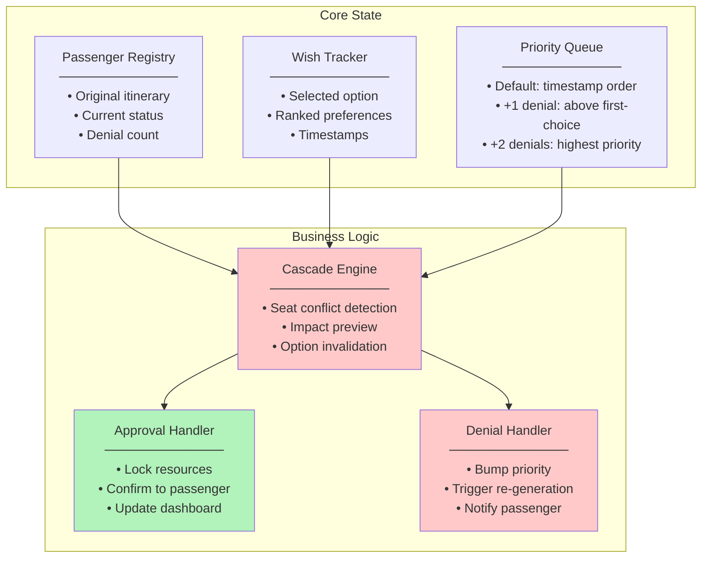
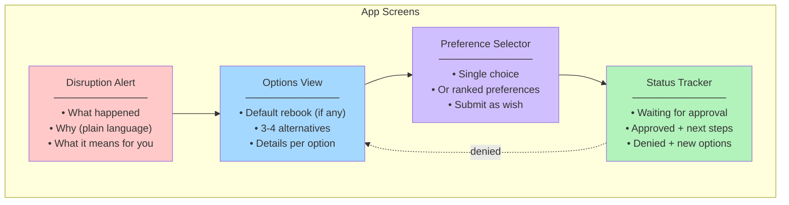
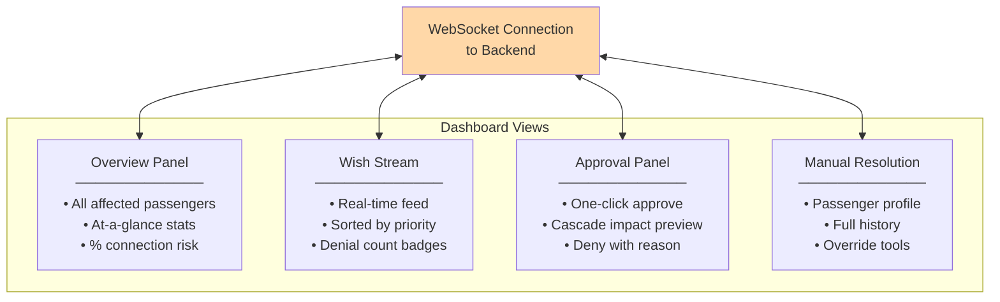
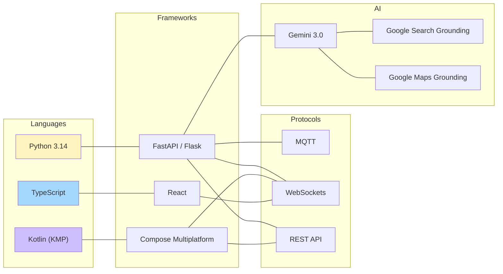

# Soft Landing — Software Architecture

> Decomposition of the system into implementable components

---

## High-Level System Overview

---

## Component Decomposition

```mermaid
graph LR
    subgraph DE["1. Disruption Engine"]
        DE_MQTT["MQTT Listener"]
        DE_PARSE["Event Parser"]
        DE_SCOPE["Impact Scope<br/>Calculator"]
        DE_NOTIFY["Notification<br/>Dispatcher"]
    end

    DE_MQTT --> DE_PARSE --> DE_SCOPE --> DE_NOTIFY

    subgraph OG["2. Option Generator"]
        OG_FLIGHT["Flight Rebooking<br/>Module"]
        OG_HOTEL["Hotel + Next-Day<br/>Module"]
        OG_GROUND["Ground Transport<br/>Module"]
        OG_ALT["Alt. Airport<br/>Module"]
        OG_EXPLAIN["Explanation<br/>Generator (Gemini)"]
    end

    subgraph SM["3. State Manager"]
        SM_PAX["Passenger Registry"]
        SM_WISH["Wish Tracker"]
        SM_PRIO["Priority Queue"]
        SM_CASCADE["Cascade Engine"]
    end

    DE_NOTIFY --> OG
    OG --> SM
```

---

## Data Flow — End-to-End Workflow

---

## Component Details & Implementable Modules

### Module 1: Disruption Engine

**Deliverables:**
- MQTT client subscribing to LH Flight Ops events
- Event parser supporting cancellation, diversion, delay types
- Affected passenger lookup (connecting passengers, destination passengers)
- Context enrichment via Gemini + Google Search grounding

---

### Module 2: Option Generator

**Deliverables:**
- 4 strategy modules (flight, hotel, ground, alt-airport), each callable independently
- Option ranking by arrival time and disruption level
- Gemini-powered plain-language explanations with Google Search/Maps grounding
- Returns 3-4 concrete options per passenger

---

### Module 3: State Manager

**Deliverables:**
- Passenger state store (in-memory for hackathon, with clear interfaces)
- Wish tracking with ranked preference support
- Priority queue with denial-based escalation
- Cascade engine: when approving one wish, detect conflicts with other passengers' wishes
- Approval/denial handlers with real-time notification dispatch

---

### Module 4: Passenger App (Kotlin Multiplatform)

**Deliverables:**
- Compose Multiplatform UI (Android, iOS, Web targets)
- Push notification receiver (WebSocket-based)
- API client for backend communication
- 4 main screens: alert, options, preference selector, status tracker

---

### Module 5: Gate Agent Dashboard (React)

**Deliverables:**
- React SPA with WebSocket connection for real-time updates
- Overview panel with disruption stats
- Live wish stream sorted by priority (denied passengers first)
- Approval workflow with cascading impact preview
- Manual resolution view for edge cases

---

## Implementation Priority

```mermaid
gantt
    title Implementation Roadmap
    dateFormat X
    axisFormat %s

    section Phase 1 — Core
    Backend scaffolding + API          :p1, 0, 2
    State Manager (in-memory)          :p2, 0, 2
    Mock disruption data               :p3, 0, 1

    section Phase 2 — Options
    Flight rebook module               :p4, 2, 4
    Hotel + next-day module            :p5, 2, 4
    Ground transport module            :p6, 2, 4
    Gemini explanation generator       :p7, 2, 4

    section Phase 3 — Interfaces
    Passenger App (KMP) screens        :p8, 4, 7
    Gate Agent Dashboard (React)       :p9, 4, 7
    WebSocket real-time layer          :p10, 4, 6

    section Phase 4 — Logic
    Priority queue + escalation        :p11, 6, 8
    Cascade engine                     :p12, 6, 8
    Approval/denial flow               :p13, 7, 9

    section Phase 5 — Integration
    MQTT disruption listener           :p14, 8, 9
    End-to-end demo scenarios          :p15, 9, 10
```

---

## Technology Map

